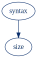
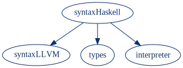
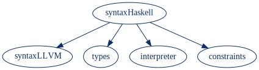

<!-- diagrams generated by `dot -Tsvg 1.dot > 1.svg`. widths are manually set to 80% because apparently it's nontrivial to automatically size an svg as percentage of its default size across browsers -->

In this article we’ll cover the basic idea behind symbolic execution, a powerful yet underutilized technique for static program analysis. Using this technique, we can *prove* that our code obeys certain properties, rather than staking the correctness of a system on a some hand-written unit and integration tests.

## Syntax and semantics

In order to understand symbolic execution, it’s helpful to see how it’s related to other forms of program analysis.

In most languages (whether human or machine) there’s an important distinction between *syntax* and *semantics*. (Abstract) syntax describes the hierarchical structure of a program. From the text (i.e. “concrete syntax”) of a program, we can produce an abstract syntax tree to describe its structure. On its own, this structure does not have any meaning — that is where a semantics comes in.

If we think of a program’s syntax as residing in some *domain* (think: set) named “syntax”, we can give the program a meaning by mapping to some other other domain. For example, if we wanted to understand the “size” of a program, we could map from syntax trees to integers, where the integer that a syntax tree maps to corresponds to the number of syntax nodes in that tree. In creating such a mapping, we provide meaning to the program:



We can provide another semantics by mapping from the syntax of one language to the syntax of another; this is what we know as *compilation* or *code generation*. Or we can map to a domain of types, where we can apply rules to perform typechecking. In each of these new domains, we can analyze a program without actually *running* it — we’re performing static analysis.

Alternatively, we can map each syntax tree to an *interpreter*, which consumes program inputs and produces a program output. For our purposes we’ll refer to *interpretation* as *concrete execution*.



In concrete execution, a client running a program must provide a concrete value for every input argument of the program. The execution proceeds sequentially — one reduction step at a time — from the beginning to the end of the program. A single execution path is taken, and the path that we take depends on the inputs that are provided.

## Symbolic execution

In symbolic execution, we send programs to yet another domain that we can use to give our syntax meaning. Symbolic execution is a form of static analysis that permits reasoning about programs with *unspecified inputs*, and that stand in for any possible concrete value. We’ll refer to these as *free variables*.

When a program has a free variable, we can consider an entire *space* of possible execution paths, one for each possible value the variable could take. Where concrete execution corresponds to a single execution path in this space, symbolic execution is concerned with the entire (potentially infinite!) space. And when there are multiple free variables in a program, the size of the space is multiplied each time, as the program can behave differently for every possible combination of concrete values.

To make this computationally tractable, instead of concerning ourselves with each and every possible path, we can represent this space of possibilities using a system of equations — a system of logical constraints.



These logical constraints represent relationships between different expressions in the program. For example, for the following program:

```haskell
f : (Int, Int) -> Int
f (x, y) = x + y + 10
```

We can express the following logical equality constraint:

$$
result = x + y + 10
$$

And consider a few of the entries from the corresponding *relation* between `x`, `y`, and the program’s `result`:

<table class="relation">
  <thead>
    <tr>
      <th><code class="language-text">x</code></th>
      <th><code class="language-text">y</code></th>
      <th><code class="language-text">result</code></th>
    </tr>
  </thead>
  <tbody>
    <tr>
      <td>-1</td>
      <td>0</td>
      <td>9</td>
    </tr>
    <tr>
      <td>0</td>
      <td>1</td>
      <td>11</td>
    </tr>
    <tr>
      <td>1</td>
      <td>2</td>
      <td>13</td>
    </tr>
    <tr>
      <td>2</td>
      <td>1</td>
      <td>13</td>
    </tr>
    <tr>
      <td>...</td>
      <td>...</td>
      <td>...</td>
    </tr>
  </tbody>
</table>

In this relational setting, we’re concerned with the *relationship* between expressions, without distinguishing program inputs as primary to the program output, or the output as strictly determined by the inputs.

Using a certain type of tool (which we’ll get to below), we can effectively perform queries over these relations. For example, we can ask, “are there any values of `x` and `y` that lead to a `result` of `13`?” In this query, `x` and `y` are free variables and the result is concrete. Where the relation above embodies a system of constraints produced from the program (with all free variables), we can think of applying this query as *further constraining* that relation:

<table class="relation">
  <thead>
    <tr>
      <th><code class="language-text">x</code></th>
      <th><code class="language-text">y</code></th>
      <th><code class="language-text">result</code></th>
    </tr>
  </thead>
  <tbody>
    <tr class="removed">
      <td>-1</td>
      <td>0</td>
      <td>9</td>
    </tr>
    <tr class="removed">
      <td>0</td>
      <td>1</td>
      <td>11</td>
    </tr>
    <tr class="added">
      <td>1</td>
      <td>2</td>
      <td>13</td>
    </tr>
    <tr class="added">
      <td>2</td>
      <td>1</td>
      <td>13</td>
    </tr>
    <tr>
      <td>...</td>
      <td>...</td>
      <td>...</td>
    </tr>
  </tbody>
</table>

And indeed, there’s at least one *model*, or satisfying assignment to the variables, under the conditions of the query.

We can ask another question: “what is the result when `x` is `3` and `y` is `100`?" When we perform this
query, there’s exactly one satisfying model:

<table class="relation">
  <thead>
    <tr>
      <th><code class="language-text">x</code></th>
      <th><code class="language-text">y</code></th>
      <th><code class="language-text">result</code></th>
    </tr>
  </thead>
  <tbody>
    <tr>
      <td>3</td>
      <td>100</td>
      <td>103</td>
    </tr>
  </tbody>
</table>

In this query, our program inputs were concrete and the result was kept free —  just like in concrete execution. In this sense, we can actually consider concrete execution as a special case of symbolic execution where we happen to be interested in *only computing “forwards”* — strictly from inputs to outputs.

And while symbolic execution allows us to “compute backwards”, and that’s quite powerful, we can actually decide to do all sorts of different things. For example, we could constrain the program `result` to be less than zero, and set only *one* of the inputs to the concrete value `5`, leaving the other input free. And then analyze this subspace of possible executions. But really there’s no reason to restrict ourselves to even the relationships between inputs and outputs — we can ask questions about how any arbitrary subexpressions of the program relate to one another.

To perform queries over these systems of constraints, we’ll enlist the aid of an *automated theorem prover*.

## SMT: Satisfiability Modulo Theories

In computer science, the *SAT* ("Boolean satisfiability”) problem is concerned with determining whether a given Boolean formula (comprised of variables, $\wedge$, $\vee$, and $\neg$) is satisfiable — whether there exists an assignment of concrete Boolean values (i.e. `true` or `false`) to variables in the formula such that the entire expression evaluates to `true`. A program which automatically performs this determination is called a SAT solver, which is one type of automated theorem prover.

Generalizing SAT, the *SMT* (“satisfiability modulo theories”) problem is concerned with determining the satisfiability of logical formulas that are not merely Boolean, but are extended to [first-order logic](https://en.wikipedia.org/wiki/First-order_logic) and support for different *theories* — support for talking about integers, real numbers, arrays, and a few other structures. In the context of symbolically executing programs, several of these theories (like integers and arrays) are quite useful, as they allow constraints to be described at a higher level of abstraction and solved more efficiently.

### Querying for satisfiability

To see how we can use an SMT solver to perform symbolic execution, let’s translate our toy program from above to [SMT-LIB](http://smtlib.cs.uiowa.edu/language.shtml), the standard language understood by SMT solvers:

```lisp
; declare logical constants for our free variables
(declare-const x Int)
(declare-const y Int)
(declare-const result Int)

; encode our program as a constraint
(assert (= result (+ x y 10)))
```

And pose a question like we mentioned above: “if `x` is `5`, is there some value of `y` that will produce a negative `result`?” By issuing the following two statements, we further constrain our space of all possible executions to only those that we care about:

```lisp
(assert (= x 5))
(assert (< result 0))
```

And indeed, when we ask [Z3](https://github.com/Z3Prover/z3), an SMT solver from Microsoft, to `(check-sat)`, we receive `sat` in response. By then issuing `(get-model)`, we receive a satisfying model:

```lisp
(model
 (define-fun x () Int
   5)
 (define-fun y () Int
   (- 16))
 (define-fun result () Int
   (- 1))
)
```

When `x`  is `5`  and `y` is `-16`, the program produces a result of `-1`.[^1]

### Querying for validity

Using an SMT solver to find a satisfying model is only one side of the coin — sometimes what we wish to show is that an *undesirable* constraint is *unsatisfiable*. For example, if we wanted to show that an implementation of the absolute value function can *never return a negative number*, we can `assert` that the program’s result *must be negative*, and check to see whether there’s some way — whether there’s some program input — to satisfy that constraint. And ideally it will turn out to be unsatisfiable. We start with our function in question:

```haskell
abs : Int -> Int
abs x = if x < 0 then 0 - x else x
```

We translate the program to SMT-LIB and *try* to induce a negative return value:

```lisp
; encode program
(declare-const x Int)
(declare-const result Int)
(assert (= result (ite (< x 0) (- 0 x) x)))

; encode "undesirable" property
(assert (< result 0))
```

And when we ask to `(check-sat)`, we receive `unsat` in return. By demonstrating that there’s no possible model where the function produces a negative number, we have *proved* that the function always returns a non-negative number.

In general, proving a formula $\phi$ is equivalent to showing that $\neg \phi$ is unsatisfiable. In this case, we say that formula $\phi$ is *valid*, or that $\phi$ is a theorem — that there is no possible model in which the formula is false. The notions of validity and satisfiability are dual:

$$
\phi \ valid \Leftrightarrow \neg (\neg \phi \ sat)
$$

If we wish to prove a property of a program in this way but unsuccessfully receive `sat` instead of `unsat` — well — now we have a concrete counterexample that we can use to debug our program! We just use `(get-model)` to retrieve one combination of inputs that causes our program to go wrong.

## Conclusion

At this point, we’ve explained the basic idea of symbolic execution and demonstrated how this technique can be applied using an SMT solver to automatically check properties of some simple programs.

To see an example of symbolic-execution-based property checking integrated into a nontrivial language with database state and side effects, check out our previous blog post about the [Pact property checker](/introducing-the-pact-property-checker/).

Stay tuned for future articles demonstrating how to implement the translation from a program to SMT-LIB, and how to usefully report counterexample models back to end users who are used to understanding programs in terms of sequential execution.

Also, while you’re here, if you have a problem or project where we can help your team apply formal methods, feel free to [reach out to us](mailto:info@monic.co)!

<small>*Thanks to [Martin Allen](https://github.com/blinky3713) and [Charlie Martin](https://github.com/cmmartin) for reading a draft of this post.*</small>

<br />

[^1]: Surprisingly, we see in the model that each of our `Int` “constants” (`x`, `y`, and `result`) are actually encoded as zero-argument functions that return `Int`. Correspondingly, an SMT-LIB expression like `(declare-const x Int)` is actually syntactic sugar for `(declare-fun x () Int)`. This declares a free, or, *uninterpreted*, function that has no user-provided concrete implementation. `(define-fun x () Int 5)` from our model is one possible assignment — an *interpretation* — for that function. It’s a constant function that always returns `5` whenever it’s called.
