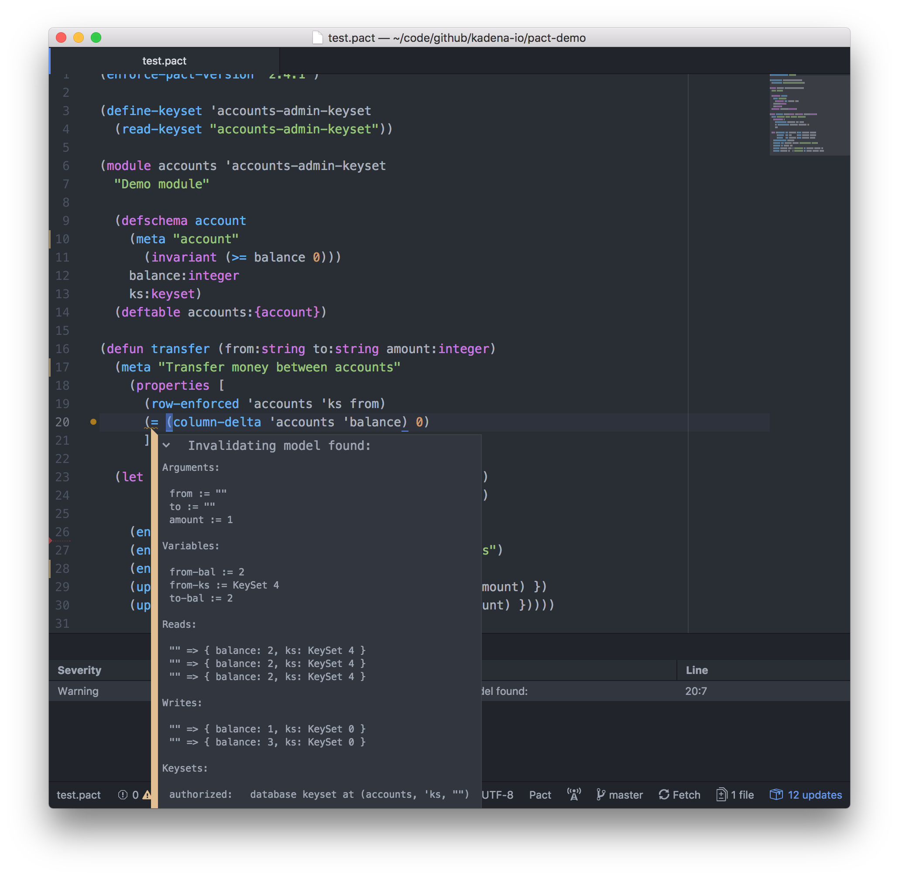

Together with [Kadena](http://kadena.io/), [Monic](https://www.monic.co/) has developed new a static analysis tool for the [Pact](https://github.com/kadena-io/pact) smart contract language that we're calling the *property checker*. In this post we'll talk about the purpose of our tool, what it can do today, and what we have planned for the future.

## Pact: some background

As a smart contract language, Pact is designed to be run within the confines of a blockchain. If you're not completely familiar with how smart contracts work, it's helpful to understand them as autonomous agents with which users interact. A user submits a transaction to the network, and if accepted into the system, this will either create a new contract, or interact with an existing one already deployed to the system. In Pact, each contract maintains state across interactions via a SQL-like table model for data.

Like most smart contract languages, Pact is deterministic (so that the same code produces the same result when executing on each node), but additionally it's much more computationally constrained than languages like Ethereum's Solidity (or the EVM generally). In Pact, there are no loops, recursion, null values, or exceptions; and authorization patterns are encoded as builtins which either successfully execute or abort (and roll back) the transaction:

```lisp
(defun read-user:user (name:string)
  "Read the user indexed by `name` if the current tx was signed by an admin. Aborts otherwise."
  (enforce-keyset 'admins)
  (read users name))
```

Here you can think of the `admins` *keyset* as a pre-published list of the public keys for all administrators of the smart contract.

## The state of smart contract security

As we've seen from the string of successful attacks on contracts in the Ethereum world, it's clear that the current approaches to smart contract security aren't working. Most exploited high-profile Ethereum contracts were written by Solidity experts or Ethereum Foundation developers. How is a newcomer to the platform expected to author a secure contract?

Though Pact was designed to make programmer errors less likely, between the combination of conditionals, DB access, and authorization concerns, programs can become non-trivial very quickly. Pact's (optional) type system goes some way toward building confidence in programs, but in the adversarial world of smart contracts, type systems and unit tests aren't sufficient for building secure systems.

## The Pact property checker

To address the current state of affairs, we've built our property checking system that allows programmers to decorate both

- table schemas with *invariants*, and
- functions with *properties* (think: theorems)

that must hold for _all_ possible inputs and database states.

The Pact property checker shares some similarities with contracts (note: not smart contracts!) from e.g. [Dafny](https://github.com/Microsoft/dafny) and [Liquid Haskell](https://ucsd-progsys.github.io/liquidhaskell-blog/)-style refinement types.

## Some simple examples

As an example, we can decorate an absolute value function with the property that the function's return value must always be non-negative:

```lisp
(defun abs:integer (x:integer)
  (meta "Returns the absolute value of an integer"
    (property (>= result 0)))

  (if (< x 0)
    (negate x)
    x))
```

and the property checker verifies that this property holds for all possible values of `x`.

Similarly we can place a schema invariant on a database table to ensure that an account balance must always be positive:

```lisp
(defschema account
  (meta "A user account"
    (invariant (>= balance 0)))

  balance:integer
  ks:keyset)
```

For this invariant, the system ensures that every function in the contract maintains the invariant on any write to a table with that schema.

We've also built editor integration for [Atom](https://atom.io/) that verifies these invariants and properties whenever a smart contract is modified during development:



To see how the property checking system would be used in the real world, let's go through a longer example.

## A real-world example: transferring funds

We'll write a simple contract for tracking user balances of a fictional currency. If you're familiar with Ethereum, you can think of this as simplified version of an [ERC20](https://en.wikipedia.org/wiki/ERC20) contract. For this example we're going to ignore concerns like issuance of the currency, and demonstrate only a `transfer` function to send funds between accounts.

<annotated-code></annotated-code>

## How does it work?

We translate Pact code into a set of [SMT solver](https://en.wikipedia.org/wiki/Satisfiability_modulo_theories) constraints (we used Microsoft's [Z3](https://github.com/Z3Prover/z3)). We then ask for a set of inputs that results in a violated invariant or property. There are three possible results:

* The solver returns, having satisfied the constraints. This means that there is a set of inputs violating the property or invariant. We display it for the user like in the example.
* The solver returns and says that the constraints are impossible to satisfy. This means that the property or invariant is *valid*.
* The solver times out. This means that we can't tell whether the property or invariant is valid without waiting for longer. The search we're asking Z3 to do is decidable, but it possible to design a combination of program and property that would take a very long time to check. This hasn't been a real problem for any contracts we've analyzed so far.

The two most important tools we use are Z3 itself, and the [SBV](http://leventerkok.github.io/sbv/) (SMT-Based Verification) library by [Levent Erkök](http://leventerkok.github.io/), which provides a high-level Haskell interface to SMT solvers.

The implementation of the Pact property checker is somewhat involved, but we can understand its basic approach via a smaller example.

### SQL injection search.

We're going to analyze a simple language intended as an example of a server-side web scripting language, where we can query a database and munge strings. We'll use sbv to implement symbolic analysis to detect possible SQL injections.

We start with the terms of the language. This is a stringly-typed language, somewhat like bash, with the following types of expressions:

* `Query`: query from the database using SQL syntax.
* `Const`: a string literal
* `Concat`: concatenate two strings
* `ReadVar`: read a variable in scope
  - `ReadVar (Concat "user_" "name")`
  - `ReadVar (Concat "user_" (ReadVar "category"))`

```haskell
-- | Simple expression language
data SQLExpr = Query   SQLExpr
             | Const   String
             | Concat  SQLExpr SQLExpr
             | ReadVar SQLExpr

-- | A simple program to query all messages with a given topic id. In SQL-like notation:
--
-- @
--   query ("SELECT msg FROM msgs where topicid='" ++ my_topicid ++ "'")
-- @
exampleProgram :: SQLExpr
exampleProgram = Query $ foldr1 Concat [ "SELECT msg FROM msgs WHERE topicid='"
                                       , ReadVar "my_topicid"
                                       , "'"
                                       ]
```

Now we need some way to translate these expressions into constraints that Z3 can solve. Perhaps surprisingly, this translation looks a lot like evaluation -- and that's because it is! This is *symbolic*, rather than the standard form of *concrete*, evaluation. In symbolic evaluation, instead of successively computing (concrete) intermediate values until we produce our output, we instead pass over the program, accumulating a set of symbolic values (think: variables) that are related to one another and are subject to certain constraints. You can think of a system of equations from early algebra classes to help conceptualize this. In a symbolic program, similar to relational or logical programming, the line between inputs and outputs is blurred; instead of computation "moving" in a single "forward" direction, inputs are merely *related* to outputs according to our "system of equations" and constraints. So as we perform symbolic evaluation, we produce a symbolic value that represents our return value, that is constructed from, and is related to, our inputs.

For this particular task, we'll fix our output SQL statement, and ask Z3 to produce a certain, satisfying user input -- effectively evaluating backwards.

```haskell
-- | Evaluation monad. The state argument is the environment to store
-- variables as we evaluate.
type M = StateT (SFunArray String String) (WriterT [SString] Symbolic)

-- | Given an expression, symbolically evaluate it
eval :: SQLExpr -> M SString
eval (Query q)      = do q' <- eval q
                         tell [q']
                         lift $ lift exists_
eval (Const str)    = return $ literal str
eval (Concat e1 e2) = (.++) <$> eval e1 <*> eval e2
eval (ReadVar nm)   = do n   <- eval nm
                         arr <- get
                         return $ readArray arr n
```

`SFunArray a b` represents a mapping (think of a block of memory or a database table) from *symbolic* values of type `a` to *symbolic* values of type `b`. Our `SFunArray String String` represents the variables in scope in our language. We also write our program's queries as `[SString]` (where `SString` is an SBV symbolic string).

Our goal is to recognize exploits. To do so we use Z3's support for regular expressions. (Where SMT stands for "satisfiability modulo theories", here we use the *theories* for strings and regular expressions).

From our experience, strings and regular expressions are quite difficult to solve for -- it's easy to accidentally generate a very large space for Z3 to search. To make the problem tractable, we use a simplified model of what exploits look like.

Note that we've overloaded Haskell's `+` and `*` operators to mean "or" and "then", respectively. This idea comes from [Gabriel Gonzalez](https://github.com/Gabriel439/slides/blob/master/regex/regex.md).

```haskell
-- | We'll greatly simplify here and say a statement is either a select or a drop:
statementRe :: RegExp
statementRe = selectRe + dropRe

-- | The exploit: We're looking for a DROP TABLE after at least one legitimate command.
exploitRe :: RegExp
exploitRe = KPlus (statementRe * "; ")
          * "DROP TABLE 'users'"
```

Finally we analyze the example program (`query ("SELECT msg FROM msgs where topicid='" ++ my_topicid ++ "'")`) to try to find an exploit:

```haskell
findInjection = do
  badTopic <- sString "badTopic"

  -- Create an initial environment that returns the symbolic
  -- value my_topicid only, and undefined for all other variables
  undef <- sString "uninitialized"
  let env :: SFunArray String String
      env = mkSFunArray $ \varName -> ite (varName .== "my_topicid") badTopic undef

  (_, queries) <- runWriterT (evalStateT (eval expr) env)

  -- For all the queries thus generated, ask that one of them be "explotiable"
  constrain $ bAny (`R.match` exploitRe) queries

  query ... -- get result from SBV
```

```
>>> findInjection exampleProgram
"h'; DROP TABLE 'users"
```

Indeed, if we substitute the suggested string, we get the program `query ("SELECT msg FROM msgs where topicid='h'; DROP TABLE 'users'")`, a [classic SQL injection](https://xkcd.com/327/).

This was a simplified example, but follows the same fundamental approach as the Pact analysis tool. The complete example is available [in the sbv repo](https://github.com/LeventErkok/sbv/blob/bfc6c80fe4e4546ba26a1bd045e87b88e973f7f4/Documentation/SBV/Examples/Strings/SQLInjection.hs).

### The smt-lib 2 output

It's almost hard to believe that the above code was all we needed to build the necessary set of constraints. This is because SBV exposes a very high level interface which does most of the heavy lifting.

To get a better understanding of what Z3 is actually doing, let's log the low-level interaction between SBV and Z3.

```
[GOOD] ; --- literal constants ---
[GOOD] (define-fun s_2 () Bool false)
[GOOD] (define-fun s_1 () Bool true)
[GOOD] (define-fun s3 () String "SELECT msg FROM msgs WHERE topicid='")
[GOOD] (define-fun s4 () String "'")
[GOOD] ; --- skolem constants ---
[GOOD] (declare-fun s0 () String) ; tracks user variable "badTopic"
[GOOD] (declare-fun s1 () String) ; tracks user variable "uninitialized"
[GOOD] (declare-fun s2 () String)
[GOOD] ; --- constant tables ---
[GOOD] ; --- skolemized tables ---
[GOOD] ; --- arrays ---
[GOOD] ; --- uninterpreted constants ---
[GOOD] ; --- user given axioms ---
[GOOD] ; --- formula ---
[GOOD] (define-fun s5 () String (str.++ s0 s4))
[GOOD] (define-fun s6 () String (str.++ s3 s5))
[GOOD] (define-fun s7 () Bool (str.in.re s6 (re.++ (re.+ (re.++ (re.union (re.++ (str.to.re "SELECT ") (re.union ((_ re.loop 1 7) (re.range "a" "z")) (str.to.re "*")) (str.to.re " FROM ") ((_ re.loop 1 7) (re.range "a" "z")) (re.opt (re.++ (str.to.re " WHERE ") ((_ re.loop 1 7) (re.range "a" "z")) (str.to.re "=") (re.union ((_ re.loop 1 7) (re.range "a" "z")) (re.++ (str.to.re "'") ((_ re.loop 1 5) (re.union (re.range "a" "z") (str.to.re " "))) (str.to.re "'")))))) (re.++ (str.to.re "DROP TABLE ") (re.union ((_ re.loop 1 7) (re.range "a" "z")) (re.++ (str.to.re "'") ((_ re.loop 1 5) (re.union (re.range "a" "z") (str.to.re " "))) (str.to.re "'"))))) (str.to.re "; "))) (str.to.re "DROP TABLE 'users'"))))
[GOOD] (assert s7)
[SEND] (check-sat)
[RECV] sat
[SEND] (get-value (s0))
[RECV] ((s0 "h'; DROP TABLE 'users"))
```

That's it! The `GOOD` lines are a translation of our program. `(assert s7)` is saying "I assert that there is no input producing a query matching our exploit pattern". Then the two sets of `SEND` / `RECV` are Z3 saying, "actually, I know a bad input" (`sat`) and "here it is" (`((s0 "h'; DROP TABLE 'users"))`).

## Future directions

We're actively developing this tool and very excited for the projects we have planned.

### Abstracting properties

Currently there's no way to define a new property by name. We have to write `(= (column-delta table 'column) 0)` where we'd rather write `conserves-mass`. [Soon](https://github.com/kadena-io/pact/pull/135) you'll be able to define new properties with `(defproperty conserves-mass (= (column-delta table 'column) 0)`.

### Improved UX

Currently, for falsifying models, we show concrete arguments, DB accesses, and whether keysets were authorized; but due to the fact that symbolic programs don't execute linearly from inputs to output, these models can be slightly confusing. Consider the code `(if (x < 10) (read accounts "a") (read accounts "b"))`: a falsifying model for this expression will actually contain values for *both* reads, even though a concrete execution would only perform one.

We plan to improve this experience by synthesizing a linear execution trace from the model, similar to what something like the Chrome DevTools debugger might show. This would contain a full walk through a single concrete execution path, without any superfluous DB accesses or variable bindings from paths not taken. This work is [currently in-progress](https://github.com/kadena-io/pact/issues/132), and we'll share more about this in an upcoming post.

### Covering all of the language

For the initial release, we punted on some parts of the language that are harder to model in Z3. In particular, we're actively working on adding [support for sequences to sbv](https://github.com/LeventErkok/sbv/pull/394) to model lists in Pact.

### Stronger defaults

Once we have `defproperty`, we'll have all of the necessary building blocks to write a `pure` property, asserting that a function doesn't read or write the database, or abort the current transaction. Our plan is to make something like this the default, so that all non-pure code must be explicitly marked.

## More to come

Those were just a few of the projects we have on our roadmap, as we work towards a great environment for writing correct contracts. Of course, there's a lot to do, and we're hiring, so if you made it this far and you're interested in our work, definitely [get in touch](mailto:joel@monic.co)!
